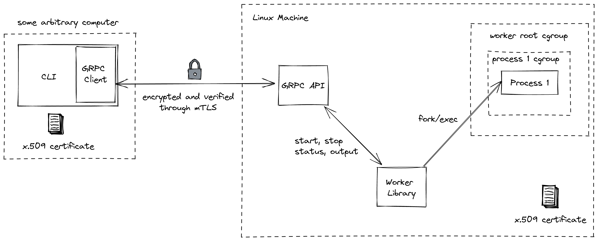

# Job Worker Service

This document describes the design of a prototype job worker service to run arbitrary Linux processes.

The diagram below shows the interactions between the components of the system. 
These are described in the following sections.



## CLI

The CLI is the main way users will interact with the worker. Users can invoke the command line application `job` to start a process, stop a process, get the process status and stream the output of a process in real time. The CLI will make calls to the GRPC API to fulfill all user commands.

Below are some examples of what interacting with the CLI will be like

### Starting a process

Users can start processes in the worker host and are able to provide limits for memory, IO and CPU. These parameters are described more in depth in the [Resource Control](#resource-control) section. The command returns
the UUID of the process which can be used to invoke further commands.

```
> job start –memMaxBytes=1000000 –maxReadBps=1000000 –maxWriteBps=1000000 –cpuBandwidth="200000 1000000" "scripts/release-docker.sh"
job 9de95676-84ed-4e37-b44c-4f4d1df7c74f started
```

### Stopping a process

Users can stop a process running in the worker host using the stop command and providing the job id.

```
> job stop 9de95676-84ed-4e37-b44c-4f4d1df7c74f
job 9de95676-84ed-4e37-b44c-4f4d1df7c74f stopped
```

### Getting the status of a process

Users can invoke the status command to get information about the process.

```
> job status 9de95676-84ed-4e37-b44c-4f4d1df7c74f
{
	"job_id": "9de95676-84ed-4e37-b44c-4f4d1df7c74f",
	"command": "ls -la",
	"pid": 51032,
	"state": "Z",
	"exit_code": 0,
	"started_by": "hashi",
	"started at": "2022-04-15T09:47:02Z",
	"finished at": "2022-04-15T10:47:02Z"
}
```

### Streaming the output of a process

Users can invoke the output command to stream the output of a process in real time (a combination
of stdout and stderr). It gets the output right from the start. The command terminates once there
is no more output to read i.e the process is done or has been terminated.

```
> job output 9de95676-84ed-4e37-b44c-4f4d1df7c74f
test command output line 1
test command output line 2
test command output line 3
test command output line 3
…
```

## Resource Control

We will use [cgroupsv2](https://www.kernel.org/doc/html/latest/admin-guide/cgroup-v2.html) to assign system resources to processes.

It is a requirement that the host runs Linux kernel 4.15 (or above) as that is the version when the cpu controller was
introduced.

On startup, the worker will create a worker root cgroup which will optionally contain some 
default values that can be provided via flags. For every process, we will create a new child of the
worker cgroup with the provided resource control values. 

We will enable users to control memory, IO and CPU. We will achieve this by exposing
API parameters that allow assigning values to the following cgroup interface files:

#### memory.max

https://www.kernel.org/doc/html/latest/admin-guide/cgroup-v2.html#memory

This is a memory usage hard limit. 

#### io.max

https://www.kernel.org/doc/html/latest/admin-guide/cgroup-v2.html#io

We will allow users to set values for the rbps (Max read bytes per second) and wbps (Max write bytes per second) map keys in the io.max interface file.

To allow users to set this option, we will need to start the worker with the $MAJ:$MIN device 
number that we would like this limit to apply to.

#### cpu.max

https://www.kernel.org/doc/html/latest/admin-guide/cgroup-v2.html#cpu-interface-files

This enables the distribution of CPU time by adjusting CPU bandwidth.

The file contains 2 value which represent the allowed time quota (microseconds) and the 
period length (microseconds).

### Resource Exhaustion

When IO and CPU limits are exceeded processes will take a longer time and users will notice that the process state is UNINTERRUPTIBLE_SLEEP/ INTERRUPTABLE_SLEEP for far too long. It will be on the user  to stop the process and retry with more resources.

In the case of Memory limits, the behaviour of `memory.max` is:

>  If a cgroup’s memory usage reaches this limit and can’t be reduced, the OOM killer is invoked in the cgroup. Under certain circumstances, the usage may go over the limit temporarily.

This manifests as:

```
dl@pop-os:# sleep 120
Killed
```

Kernel Logs:
```
Apr 21 14:29:06 pop-os kernel: [178228.853564] sleep invoked oom-killer: gfp_mask=0xcc0(GFP_KERNEL), order=0, oom_score_adj=0
Apr 21 14:29:06 pop-os kernel: [178228.853656]  oom_kill_process.cold+0xb/0x10
Apr 21 14:29:06 pop-os kernel: [178228.853968] oom-kill:constraint=CONSTRAINT_MEMCG,nodemask=(null),cpuset=/,mems_allowed=0,oom_memcg=/testing_stuff,task_memcg=/testing_stuff,task=sleep,pid=420326,uid=0
```

## GRPC API

The service exposes a gRPC API that gives capabilities to start a process, stop a process, get process status and stream process output.

The proposed proto file can be found here: [worker_official.proto](./worker.proto)

The GRPC server will be calling methods in the worker library to interact with processes.

### Authentication

The service will use mTLS to secure traffic and verify client and server authenticity. For this design document, we will make the assumption that the Certificate Authority (CA) can be trusted i.e. certificates are only issued to users and nodes that have been verified.

Both server and client will support TLS version 1.3.

The [grpc-go](https://github.com/grpc/grpc-go) package that we will be using to implement the server and client
give direct access to the standard library's `tls.Config` struct so it should be relatively simple to verify both
client and server certificates.

### Public Keys

Following the guidance from:

[Recommendations for Secure Use of Transport Layer Security and Datagram Transport Layer Security (DTLS)](https://www.ietf.org/archive/id/draft-ietf-uta-rfc7525bis-03.html#section-4.5)

We will use RSA with at least a 2048-bit modulus for the public key.

### Required Certificate Attributes

As recommended in [https://datatracker.ietf.org/doc/html/rfc5280#section-4.1.2.4](RFC5280) The following fields will be required for all certificates in issuer and subject names.

* country,
* organization,
* organizational unit,
* distinguished name qualifier,
* state or province name,
* common name (e.g., "Susan Housley"), and
* serial number

Additionally, all certificates should have an expiration date.

### Certificate Hierarchy

The diagram below shows the certificate hierarchy. A self signed root certificate belonging
to the root CA will be signing the certificates for users and hosts. The host and user will
need to have a copy of this root certificate in order to verify each other.


### Cipher Suites

#### TLS 1.3

We will follow the guidance from these RFCs:

[Recommendations for Secure Use of Transport Layer Security and Datagram Transport Layer Security (DTLS)](https://www.ietf.org/archive/id/draft-ietf-uta-rfc7525bis-03.html)

[Hypertext Transfer Protocol Version 2 (HTTP/2) Appendix A](https://datatracker.ietf.org/doc/html/rfc7540#appendix-A)

We will only accept cipher suites that match the following criteria:
* Key exchange algorithm supports perfect forward secrecy
* No RC4 cipher suites
* No cipher suites including algorithms offering less than 128 bits of security
* No cipher suites which use static RSA i.e cipher suites starting with TLS_RSA_WITH_*
* Cipher Suite is not blacklisted by HTTP/2

All TLS 1.3 supported cipher suites satisfy these conditions and thus, can be negotiated.

### Authorisation

X.509 certificates issued to users will have information about the user name encoded in them in the Common Name subject field. The server will then use this information to decide if a requester has been given permission to make requests.

Users may only interact with jobs they started themselves.

## Worker Library

The service will include a worker library written in Go to manage and interact with Linux and Linux processes.
Under the hood, this is what the GRPC server will use to fulfill requests.

A sketch of what this library could look like is below:

```go
// Worker is a Linux process manager
// It keeps a registry of the processes that it
// been requested to manage in memory.
type Worker struct {
	defaultresourceLimits ResourceLimits
	execRegistry          map[ID]*ProcessHandle
}

// ID is the internal ID that the worker uses to identify an Exec
// Under the hood this might just be a UUID
type ID string

type ResourceLimits struct {
	MaxMemoryBytes int64
	// ...
}

// ProcessRequest represents a request to execute a Linux process in the worker
type ProcessRequest struct {
	// Command is the command executed to be executed
	Command string

	// Args are the arguments for the command
	Args []string

	// ResourceLimits specifies the resources that the process will have access to
	// These translate to cgroup interface files configuration.
	ResourceLimits ResourceLimits

	RequestedBy string
}

// StartProcess starts a new process and adds it to the worker
// process registry. It does not wait for the process to terminate.
func (w *Worker) StartProcess(req ProcessRequest) (ID, error) {
	// ...
}

// StopProcess stops a process currently managed by the worker
// Returns an error if there was any issues stopping the process
// or the process does not exist in the worker registry.
func (w *Worker) StopProcess(processId ID) error {
	// ...
}

// ProcessInfo gives access to information about a
// process.
type ProcessInfo interface {
	PID() int
	StartedBy() string
	State() string
	StartedAt() time.Time
	FinishedAt() time.Time
}

// GetProcessInfo gives access to the ProcessInfo interface
// which allows querying for information about the process.
func (w *Worker) GetProcessInfo(processId ID) ProcessInfo {
	// ...
}

// StreamProcessOutput returns a channel to receive process output
// in real time. If any errors are encountered during execution the error
// will be sent in the errorChan. Otherwise, outputChan only closes when
// process is done sending output
func (w *Worker) StreamProcessOutput(processId ID) (outputChan <-chan ProcessOutputEntry, errChan <-chan error, err error) {
	// ...
}

type ProcessOutputEntry struct {
	Content    []byte
	ReceivedAt time.Time
}

```

### Output Streaming

* When a process is started, a new goroutine is spawned that buffers output
and forwards new messages to listeners.
* When `worker.StreamProcessOutput` output is called, a new listener is registered and the caller
receives `outputChan` and `errChan` (see worker library sample above). Through the `outputChan`, all 
the buffered output up to the present time is sent. `outputChan` then continues receiving new
output until the process finishes or is killed (this would trigger channel closure). If there is any
errors while reading output, it will be sent through `errChan`. To ensure that no output is lost
during the transition from reading existing output to streaming new output all listeners and
buffer operations must be behind a mutex. That is, we can't both add a new listener, send output to
listeners and read the buffer. Only one of these things can happen at once.
* If a `worker.StreamProcessOutput` is called after process is finished, same applies. Buffer will
be in memory so output can still be sent while worker is running.

## Process Life Cycle

When there is a request to start a new process, the following will happen:

* The library will fork/exec a new process (via [Cmd.Start](https://pkg.go.dev/os/exec#Cmd.Start))
* A new cgroup will be created for this process 
* The process PID will be written to the relevant `cgroup.procs` file

When there is a request to stop a new process, the following will happen:
* The process will be killed using https://pkg.go.dev/os#Process.Kill (we can retrieve the Process type via ProcessState)

## Limitations

* No Role Based Access Control (RBAC), so there is no distinction between users that can perform different actions. For example, we might want users to be able to look at command output but not start or stop processes. A future improvement could be to also encode a role in the certificate in a similar way to how [Teleport does it](https://github.com/gravitational/teleport/blob/57cc2ed3554811dbfa4f33d23c58a7850148d504/lib/tlsca/ca.go#L93).

* In Linux, there are many cgroup interface files available and a lot of flexibility in how to 
manage resource allocation. The cgroup interface files we will be using were chosen as a proof
of concept and can be updated in future based on user/developer feedback.

* The services operates under the assumption that the host has already been setup to
contain required software or dependencies for the commands that it is asked to execute.
This can be done with tools such as Ansible, Packer or Terraform. 
